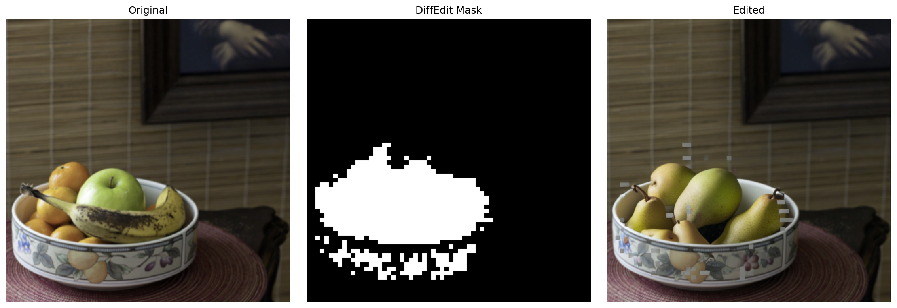

# Adaptive Region Image Editing

Text-guided semantic image editing pipeline using diffusion models, automatic region localization, latent inversion, and high-resolution inpainting.

This project performs controlled image editing by:
- automatically identifying editable semantic regions
- generating region-aware masks
- preserving non-edited image content
- applying prompt-guided modifications only where needed

The system combines:
- semantic mask generation
- latent inversion
- high-resolution diffusion inpainting

to produce localized and controllable image edits from natural language prompts.

---

# Demo

## Original vs Region Mask vs Edited Result



---

# Overview

Traditional text-to-image editing often modifies large portions of an image unintentionally.

This project introduces a more controllable editing pipeline that:
- detects semantically relevant regions
- preserves unrelated image areas
- performs localized edits
- maintains visual consistency

The workflow uses:
1. semantic difference estimation
2. latent-space inversion
3. diffusion-based inpainting

to generate high-quality edits from text prompts.

---

# Core Features

## Automatic Semantic Region Detection

The system automatically identifies image regions related to the desired modification using semantic noise differences between prompts.

Examples:
- changing fruits into pears
- modifying clothing
- editing objects
- changing attributes
- localized scene manipulation

No manual mask drawing is required.

---

# Latent Inversion

The pipeline performs DDIM latent inversion to:
- preserve original image structure
- maintain composition consistency
- improve edit controllability
- reduce unnecessary modifications

This helps the generated image stay close to the original image.

---

# High-Resolution Inpainting

The final editing stage uses high-resolution diffusion inpainting for:
- sharper details
- localized modifications
- realistic blending
- improved visual quality

Only masked regions are modified while surrounding content is preserved.

---

# Pipeline Stages

| Stage | Description |
|---|---|
| Semantic Difference Analysis | Detects editable regions from prompt differences |
| Mask Generation | Creates binary semantic editing masks |
| Latent Inversion | Encodes image structure into latent space |
| Guided Inpainting | Applies localized prompt-based editing |
| Final Rendering | Produces high-quality edited image |

---

# Architecture

The system uses a multi-stage diffusion editing workflow:

```text
Input Image
     ↓
Prompt Conditioning
     ↓
Semantic Difference Estimation
     ↓
Automatic Mask Generation
     ↓
Latent Inversion
     ↓
High-Resolution Inpainting
     ↓
Edited Output Image
```

---

# Example Usage

Input:
- Source Prompt:
  ```text
  a bowl of fruits
  ```

- Target Prompt:
  ```text
  a bowl of pears
  ```

Output:
- automatically generated semantic mask
- localized image modification
- preserved background content

---

# Repository Structure

```text
adaptive-region-image-editing/
│
├── adaptive_region_editing.py
│
├── assets/
│   ├── architecture.png
│   ├── feature_overview.png
│   ├── fruits.png
│   └── edit.png
│
├── requirements.txt
├── README.md
└── LICENSE
```

---

# Installation

Clone the repository:

```bash
git clone https://github.com/sqqshh/Adaptive-Region-Image-Editing.git
cd adaptive-region-image-editing
```

Install dependencies:

```bash
pip install -r requirements.txt
```

---

# Requirements

Main libraries used:

- PyTorch
- diffusers
- transformers
- accelerate
- Pillow
- NumPy
- matplotlib

---

# Running the Pipeline

Run:

```bash
python adaptive_region_editing.py
```

---

# How To Use

Modify these parameters inside the script:

```python
img_url = "YOUR_IMAGE_URL"

source_prompt = "what currently exists in image"

target_prompt = "desired edited version"
```

Example:

```python
img_url = "https://example.com/image.png"

source_prompt = "a red sports car"

target_prompt = "a blue sports car"
```

The pipeline will:
1. download the image
2. generate semantic editing masks
3. invert the image into latent space
4. perform localized editing
5. save the final output image

---

# Output

The pipeline produces:
- generated semantic masks
- edited high-resolution images
- comparison visualizations

Final outputs are automatically saved locally.

---

# Technical Highlights

## Semantic Difference Estimation

The editable region is discovered by comparing diffusion noise predictions conditioned on:
- source prompts
- target prompts

This allows automatic localization of semantically relevant areas.

---

## Controlled Editing

The system preserves:
- geometry
- composition
- background regions
- lighting consistency

while modifying only target semantic regions.

---

## Memory-Efficient GPU Execution

The implementation is optimized for:
- Kaggle T4 GPUs
- mixed precision inference
- sequential model loading
- reduced VRAM usage

allowing large diffusion pipelines to run on limited hardware.

---

# Applications

Potential use cases:
- object replacement
- fashion editing
- product visualization
- scene modification
- creative image editing
- semantic image manipulation
- localized AI-assisted design

---

# Future Improvements

Potential extensions:
- interactive editing UI
- video editing support
- real-time editing
- multi-region editing
- stronger identity preservation
- instruction-based editing
- multimodal editing controls

---

# Technologies Used

- Python
- PyTorch
- HuggingFace Diffusers
- Stable Diffusion
- SDXL Inpainting
- DDIM Inversion
- NumPy
- PIL
- Matplotlib

---

# Key Learnings

This project provided practical experience with:
- diffusion model internals
- latent-space manipulation
- semantic mask generation
- prompt-guided image editing
- inversion techniques
- memory-efficient inference
- high-resolution inpainting workflows

It also demonstrated how semantic conditioning can be used for localized and controllable image editing.

---
